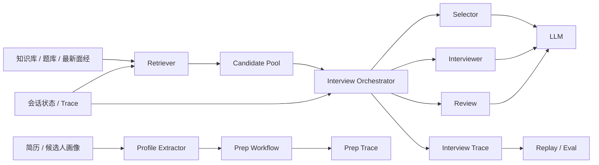

# Interview Copilot

Interview Copilot 是一个面向 AI / 大模型 / Agent 岗位准备场景的面试陪练系统。它不是简单的题库问答页，而是把知识检索、候选人画像、追问逻辑、复盘评分和运行时状态串成一条完整链路：

`知识采集 -> 面试准备 -> 模拟面试 -> 复盘 -> 下一轮训练`

仓库分成两层：

- `nanobot/`: 通用的 agent runtime，负责会话、工具、通道、消息总线、provider、gateway
- `copilot/`: 面试业务层，负责知识库、候选人画像、mock interview、review、demo

## 适合谁

- 想把项目包装成更像“Agent Harness”而不是“Prompt + RAG Demo”的同学
- 正在准备 AI 算法、LLM、Agent、RAG、系统设计类面试的同学
- 想把本地知识库、简历内容和最近面经串起来做项目展示的同学
- 想接入 CLI、Web Demo、钉钉等多入口的人

## 核心能力

- `检索增强`
  从本地知识库、题库、近期面经中抽取候选问题和背景材料
- `候选人画像`
  基于简历或自述提取项目、技术栈、亮点与风险点
- `面试准备`
  生成 prep pack，包括主打项目、岗位差距、证据缺口、训练建议
- `模拟面试`
  支持项目导向的多轮追问，而不是一次性生成固定问卷
- `结构化复盘`
  输出评分、薄弱点、下一轮 drill 建议
- `多入口接入`
  支持终端、Web Demo、gateway/channel 模式；其中 DingTalk 已内置

## 架构概览



更详细的设计说明见 [docs/INTERVIEW_COPILOT_ARCHITECTURE.md](docs/INTERVIEW_COPILOT_ARCHITECTURE.md)。

## 5 分钟快速开始

### 1. 安装依赖

```bash
pip install -e .
```

### 2. 初始化配置

首次运行建议执行：

```bash
nanobot onboard
```

这会创建：

- 配置文件：`~/.nanobot/config.json`
- 默认 workspace：`~/.nanobot/workspace`

### 3. 配置模型 Provider

推荐两种最直接的方式：

#### 方式 A：环境变量

如果你只想先跑通本地 CLI / Web Demo，这是最快的方式。

```powershell
# Windows PowerShell
$env:OPENAI_API_KEY="your_openai_key"
$env:DASHSCOPE_API_KEY="your_dashscope_key"
```

```bash
# macOS / Linux
export OPENAI_API_KEY="your_openai_key"
export DASHSCOPE_API_KEY="your_dashscope_key"
```

如果两个都配了，`copilot` 会优先按显式配置决定；没有显式指定时会根据可用 key 自动选择。

#### 方式 B：编辑 `~/.nanobot/config.json`

下面是一个更适合长期使用的示例。这个文件使用 `camelCase` 键名。

```json
{
  "agents": {
    "defaults": {
      "workspace": "~/.nanobot/workspace",
      "model": "openai/gpt-5.4",
      "provider": "auto",
      "maxTokens": 8192,
      "contextWindowTokens": 65536,
      "temperature": 0.1,
      "maxToolIterations": 40
    }
  },
  "copilot": {
    "textProvider": "openai",
    "embeddingProvider": "openai",
    "rerankProvider": "dashscope"
  },
  "providers": {
    "openai": {
      "apiKey": "YOUR_OPENAI_API_KEY",
      "apiBase": "https://api.openai.com/v1"
    },
    "dashscope": {
      "apiKey": "YOUR_DASHSCOPE_API_KEY",
      "apiBase": "https://dashscope.aliyuncs.com/compatible-mode/v1"
    }
  }
}
```

如果你主要想用通义系模型，也可以把默认模型和 provider 改成：

```json
{
  "agents": {
    "defaults": {
      "model": "dashscope/qwen-max",
      "provider": "dashscope"
    }
  },
  "copilot": {
    "textProvider": "dashscope",
    "embeddingProvider": "dashscope",
    "rerankProvider": "dashscope"
  }
}
```

### 4. 启动终端版 Copilot

```bash
interview-agent
```

进入后可以先试：

```text
/help
/prep agent --resume "D:\resume\CV.typ" --company ByteDance --position "AI Agent Intern" --target "Agent orchestration, retrieval, evaluation, tracing"
/interview agent --resume "D:\resume\CV.typ"
/review
```

### 5. 启动本地 Web Demo

```bash
interview-demo --open-browser
```

默认地址：

- `http://127.0.0.1:18820`

这个 demo 直接调用真实 runtime，不是伪造的静态对话页。

## 日常使用流程

推荐按下面的顺序使用：

1. 更新最近面经
2. 生成 prep pack
3. 启动 mock interview
4. 回答 2-6 轮问题
5. 运行 `/review` 获取复盘和下一轮训练建议

### 常用命令

```text
/help
/menu
/new
/ingest 7
/recent 7
/digest 1
/prep agent --resume "D:\resume\CV.typ" --company ByteDance --position "AI Agent Intern" --target "Build agent workflows, retrieval, evaluation"
/interview agent --resume "D:\resume\CV.typ"
/interview agent --style coding-first
/review
/schedule_digest
/restart
```

### 每个命令是做什么的

- `/ingest [days]`
  拉取并整理最近的牛客面经，写入本地知识资产
- `/recent [days]`
  查看最近保留下来的面经材料
- `/digest [days]`
  生成简明的本地日报 / 摘要
- `/prep ...`
  基于 topic、简历、公司和岗位信息生成 prep pack
- `/interview ...`
  开始一轮实时 mock interview
- `/review`
  基于当前会话生成结构化复盘
- `/schedule_digest`
  为当前聊天目标创建每日 9:00 digest 定时任务
- `/new`
  清空当前会话，开启新 session
- `/help`
  查看命令菜单

### `resume` 参数支持什么格式

当前支持：

- `.txt`
- `.md`
- `.typ`

例如：

```text
/prep agent --resume "D:\resume\CV.md"
/interview rag --resume "D:\resume\Candidate.typ"
```

## 运行模式

### 1. 终端模式

适合开发、调试、录屏和本地试跑：

```bash
interview-agent
```

### 2. Web Demo 模式

适合做展示页、录作品集、截图：

```bash
interview-demo --open-browser
```

### 3. Gateway / IM 通道模式

适合接入钉钉、Telegram、Slack 等消息平台：

```bash
interview-gateway
```

也可以直接用原始命令：

```bash
nanobot gateway
```

如果你要接入 DingTalk，这一模式是必须的，因为钉钉消息由 gateway 负责收发。

## 配置说明

### 配置文件位置

默认配置文件：

- `~/.nanobot/config.json`

默认 workspace：

- `~/.nanobot/workspace`

默认运行时目录还会包括：

- `~/.nanobot/media/`
- `~/.nanobot/logs/`
- `~/.nanobot/cron/`

说明：

- 上面这些路径是按默认配置路径推导出来的
- `copilot` 业务产生的知识资产、trace、向量库等仍主要位于项目仓库自己的 `data/` 目录下

### Provider 选择建议

如果你更在意：

- 英文能力和通用性：优先 OpenAI
- 中文体验、成本和国内可达性：优先 DashScope / Qwen

当前 `copilot/config.py` 内置了两套默认模型偏好：

- `openai`
  `chat / analysis / rewrite / judge = gpt-5.4`
  `embedding = text-embedding-3-small`
- `dashscope`
  `chat / analysis / judge = qwen-max`
  `rewrite = qwen-turbo`
  `embedding = text-embedding-v4`
  `rerank = qwen3-rerank`

### 常用排查命令

查看当前配置和 provider 状态：

```bash
nanobot status
```

查看可用 channel：

```bash
nanobot channels status
```

## 接入钉钉

这一节按“从 0 到能聊”来写。

### 接入方式

当前仓库内置的是 `DingTalk Stream Mode` 通道实现：

- 通过 `dingtalk-stream` SDK 接收钉钉事件
- 通过钉钉 HTTP API 主动发送消息
- 支持单聊和群聊
- 支持图片 / 文件接收与回传

### 第 1 步：在钉钉开放平台创建应用 / 机器人

你需要先在钉钉开发者后台拿到两项凭证：

- `Client ID`
- `Client Secret`

README 这里不硬编码平台侧截图步骤，因为钉钉控制台可能调整，但从代码上看，最终运行时只依赖这两个字段。

### 第 2 步：编辑 `~/.nanobot/config.json`

在配置文件中加入 `channels.dingtalk`：

```json
{
  "channels": {
    "sendProgress": true,
    "sendToolHints": false,
    "dingtalk": {
      "enabled": true,
      "clientId": "YOUR_DINGTALK_CLIENT_ID",
      "clientSecret": "YOUR_DINGTALK_CLIENT_SECRET",
      "allowFrom": ["*"]
    }
  }
}
```

推荐你先用：

```json
"allowFrom": ["*"]
```

先确认链路能通，再收紧成指定用户 ID 列表。

### 第 3 步：理解 `allowFrom`

这个字段很重要，行为如下：

- `[]`
  拒绝所有人，等同于没开放
- `["*"]`
  允许所有来源
- `["user123", "user456"]`
  只允许指定用户

注意：

- 代码里空列表会被视为“拒绝全部”
- `gateway` 启动时也会校验这一点，避免你以为机器人挂上了但其实谁都不能用

### 第 4 步：启动 Gateway

```bash
interview-gateway
```

如果想看更详细的启动日志：

```bash
nanobot gateway --verbose
```

### 第 5 步：在钉钉里发第一条消息

第一次测试时，建议直接发送：

```text
你好
```

或：

```text
/help
```

当前实现里，如果 DingTalk 会话的第一条消息看起来像问候语，机器人会自动返回命令菜单。

### 第 6 步：开始真实使用

在钉钉里你可以直接发送：

```text
/ingest 7
/prep agent --resume "D:\resume\CV.typ" --company ByteDance --position "AI Agent Intern"
/interview agent --style coding-first
/review
```

### 单聊和群聊说明

- 单聊：直接按用户 ID 路由
- 群聊：机器人会自动按群会话回复
- 群聊消息内部会带 `group:` 前缀做路由，这部分对使用者透明

### DingTalk 文件和图片处理

当前实现支持：

- 接收图片消息
- 接收文件消息
- 下载到本地媒体目录
- 在回复中继续发送文本和附件

默认配置下，钉钉收到的文件会落到：

- `~/.nanobot/media/dingtalk/<sender_id>/`

### 钉钉接入常见问题

#### 1. 机器人启动了，但消息没反应

优先检查：

- `channels.dingtalk.enabled` 是否为 `true`
- `clientId` / `clientSecret` 是否填写正确
- `allowFrom` 是否误写成空数组 `[]`
- 是否启动的是 `interview-gateway`，而不是 `interview-agent`

#### 2. 我想先快速验证链路

最简单的 smoke test：

1. `allowFrom` 先写成 `["*"]`
2. 启动 `interview-gateway`
3. 在钉钉里给机器人发 `你好`
4. 收到菜单后再改回精确 allow list

#### 3. 为什么 CLI 能用，钉钉不能用

因为两者入口不同：

- `interview-agent` 是本地终端会话
- `interview-gateway` 才负责消息平台通道收发

## 一个推荐的演示流程

如果你想把这个项目做成作品集演示，推荐这样录：

1. 运行 `/ingest 7`
2. 运行 `/prep agent --resume ...`
3. 打开 `interview-demo --open-browser`
4. 运行 `/interview agent`
5. 回答 2 到 3 轮
6. 运行 `/review`
7. 截图保留 `Next Drill` 和 review 结果

## 仓库结构

```text
copilot/
  app.py                 面试业务边界
  prep.py                prep pack 生成
  interview/             mock interview 编排、状态、trace、review
  knowledge/             知识库与摘要视图
  profile/               简历解析与候选人画像
  sources/               外部数据源接入（如牛客）
  workflows/             digest / workflow 编排

nanobot/
  agent/                 agent loop、tools、memory、skills
  channels/              IM 通道（含 dingtalk）
  cli/                   命令行入口
  config/                配置模型与路径
  providers/             各类 LLM provider 适配

data/
  knowledge_base/        本地知识库
  traces/                prep / interview trace
  vector_db/             向量索引
```

## 为什么它不只是 Prompt + RAG

- RAG 只负责给出候选材料和上下文
- 真正的面试控制流由 runtime 代码维护
- 会话状态、项目切换、review、trace 都是显式代码逻辑
- 同一套核心能力既能跑 CLI，也能跑 Web，也能挂到钉钉

## 文档入口

- [PROJECT_GUIDE.md](PROJECT_GUIDE.md)
- [docs/INTERVIEW_COPILOT_ARCHITECTURE.md](docs/INTERVIEW_COPILOT_ARCHITECTURE.md)
- [docs/INTERVIEW_COPILOT_MEMORY.md](docs/INTERVIEW_COPILOT_MEMORY.md)
- [docs/INTERVIEW_COPILOT_RESUME.md](docs/INTERVIEW_COPILOT_RESUME.md)
- [docs/INTERVIEW_COPILOT_ROADMAP.md](docs/INTERVIEW_COPILOT_ROADMAP.md)

## 当前状态

已实现：

- prep workflow
- 项目导向的 mock interview
- review + next drill
- local web demo
- Nowcoder ingest / recent / digest
- DingTalk channel 接入

下一步可继续增强：

- 更完整的 replay / eval 面板
- 更强的知识重建与质量控制
- 更成熟的多通道部署说明
- 更完善的 screenshot-ready demo 流程
