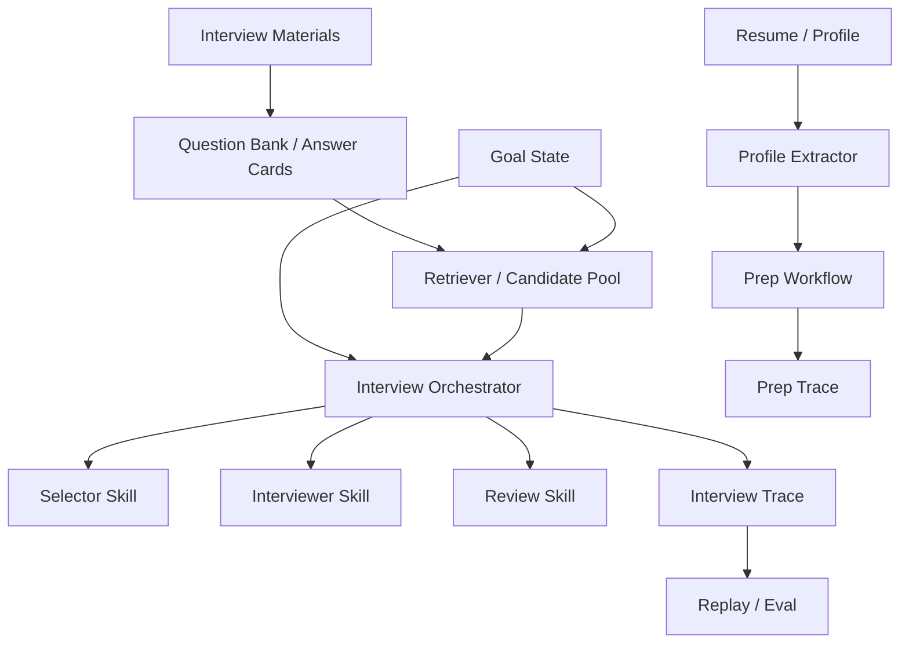

# Interview Copilot Architecture

## Positioning

Interview Copilot is best understood as:

> a retrieval-augmented interview agent harness built on top of a lightweight agent runtime

It is not:

- a plain question-bank app
- a crawler plus prompt wrapper
- a huge generic multi-agent platform

It is:

- a focused vertical harness for interview preparation
- a showcase of stateful runtime, retrieval grounding, traces, and evaluation

Default runtime mode is a single online interviewer agent. Retrieval provides a grounded candidate pool, but the LLM still owns wording, follow-up direction, and clarification during the live session.

## Layer Split

### `nanobot/`

Horizontal runtime layer.

Owns:

- agent loop
- tool registry
- memory infrastructure
- provider integration
- session handling
- channels and CLI

### `copilot/`

Vertical interview layer.

Owns:

- prep workflow
- interview planning and orchestration
- goal state and project-phase control
- review logic
- traces and evaluation
- interview-domain retrieval assets

## System Shape

## Runtime Stance

- The online path is intentionally single-agent.
- Retrieval narrows and grounds the candidate pool, but does not rigidly script the interviewer.
- Code owns project focus, phase control, switching policy, traces, and evaluation boundaries.
- The LLM owns natural interviewing behavior: phrasing, clarification, follow-up framing, and review language.

## Core Domain Objects

### Prep

Primary file:

- [prep.py](../copilot/prep.py)

Responsibilities:

- summarize candidate profile
- highlight lead projects
- infer target-role signals
- compare resume signals against target-role requirements
- output a training plan and seed questions
- persist a prep trace

### Mock Interview

Primary files:

- [orchestrator.py](../copilot/interview/orchestrator.py)
- [state.py](../copilot/interview/state.py)
- [planner.py](../copilot/interview/planner.py)
- [selector.py](../copilot/interview/selector.py)
- [interviewer.py](../copilot/interview/interviewer.py)

Responsibilities:

- build a candidate question pool
- maintain active project and project phase
- choose the next question
- render a natural interviewer prompt
- handle follow-ups and clarification
- prevent the session from getting stuck in one project phase forever
- save a structured interview trace

### Review

Primary file:

- [evaluation.py](../copilot/interview/evaluation.py)

Responsibilities:

- score answers across multiple dimensions
- summarize weak points
- generate the next drill list

## Memory Boundary

The project intentionally separates:

- `nanobot memory`
  default long-term memory layer
- `copilot state`
  structured, session-local runtime control
- `copilot trace`
  replay and evaluation artifact

This prevents the interview system from hiding core control flow inside a second long-term memory implementation.

It also keeps the design legible in interviews: `nanobot` remembers durable context, while `copilot` exposes runtime policy and artifacts in code.

## Why This Design Reads Well on a Resume

Because the repo demonstrates:

- a real runtime/host split
- a domain harness instead of a toy prompt app
- retrieval as a system capability, not a buzzword
- traces and evaluation, not just chat UX
